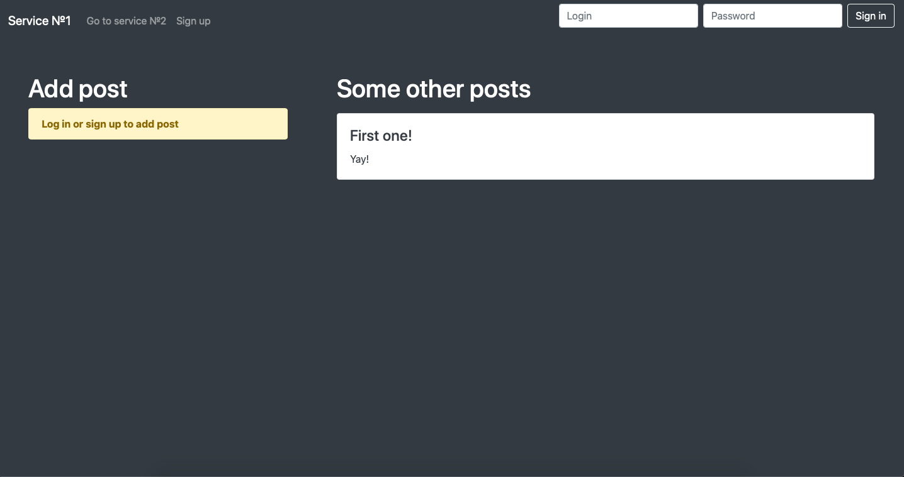

# php-synchronizer
This script files provide records synchronisation between two independent websites with similar database structure (e.g. When th user creates a post using first service, the same post automatically created in second service and vice versa)
ую

